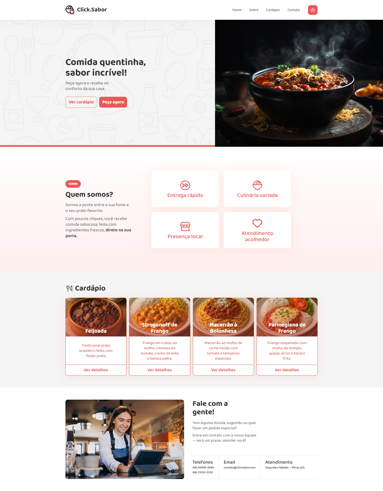
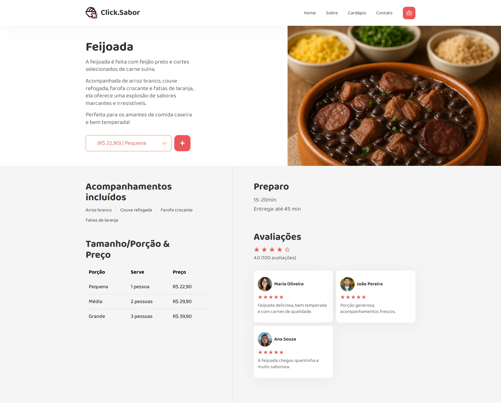
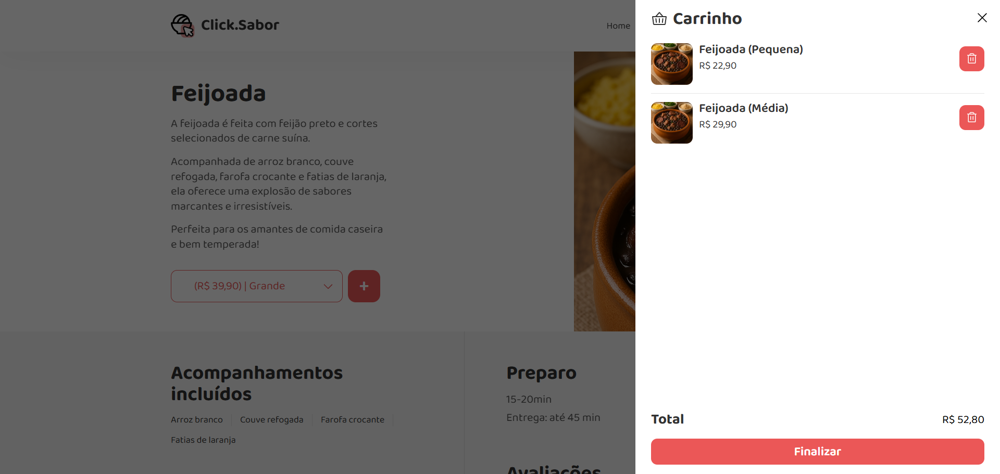

# Click Sabor

Click Sabor is a web application designed to showcase a modern and responsive restaurant website. The project demonstrates the use of contemporary web technologies to create an engaging user experience for browsing menus, placing orders, and exploring restaurant features.

Website link: https://vitorlinsbinski.github.io/clicksabor-website/

## Technologies Used

- HTML5
- CSS3
- JavaScript

## Demonstration

